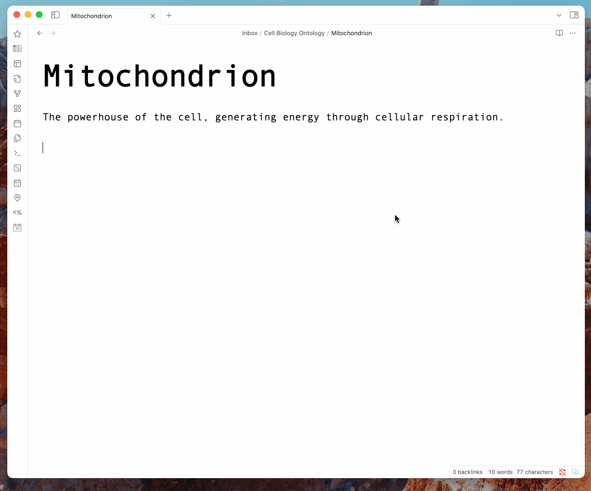

# Relational Links Plugin for Obsidian

The **Relational Links Plugin** enriches your Obsidian notes by allowing you to create customizable, semantic relationships between notes using tag-like relational links. This plugin makes it easy to organize complex information networks by enabling unique, user-defined link types that go beyond traditional linking methods in Obsidian.

## Table of Contents
- [Features](#features)
- [Installation](#installation)
- [Usage](#usage)
- [Example](#example)
- [Contributing](#contributing)
- [License](#license)

## Features

- **Flexible, Customizable Links**: Define any relationship you need by creating unique link tags on the fly. Each link name behaves like a tag, so you can name relationships based on your context (e.g., `#[influences[Note]]`, `#[depends-on[Note]]`, `#[clarifies[Note]]`).
- **Autocomplete Support**: The plugin will autocomplete relational based on previously used link names. It will also autocomplete the target note's filename as if it were a regular link.

## Installation

Since this plugin is not yet available on the official Obsidian Plugin Marketplace, follow these steps to install it manually:

1. **Download the Plugin**: Clone or download the repository from GitHub:
    ```bash
    git clone https://github.com/ben-miller/relational-links.git
    ```

2. **Locate Your Plugins Folder**: Typically this is in `<vault-dir>/.obsidian/plugins`.

3. **Move the Plugin Folder**: Copy or move the downloaded folder (`relational-links`) into the `plugins` folder.

4. **Enable the Plugin**: In **Settings > Community Plugins**, activate **Relational Links Plugin**.

5. **Restart Obsidian**: For best results, restart Obsidian to ensure the plugin loads properly.

## Usage

With the Relational Links Plugin activated, you can start creating relational links in your notes using the format:

```
#[relationship-name[linked-note]]
```



### How to Use Relational Links

1. **Define Relationships**: Place the relational tag anywhere in a note to establish a connection. For example:
```
#[is-example-of[Note Title]]
#[depends-on[Research Notes]]
#[supports[Project Overview]]
```

2. **Autocomplete for Existing Links**: Start typing any relational link (e.g., `#[is-part-of`), and the plugin will offer autocomplete suggestions based on previously used link names. Then you'll be provided with a second autocomplete list for filling out the target note's filename.

3. **Custom Relationships**: Create new relationship names as needed—just like tags, these names are flexible and based on your specific context and preference.

### Viewing and Managing Links

Currently, you can use Obsidian’s native search and backlink features to explore and manage the connections. Additional support for visualizing or filtering these relationships (if planned) will be outlined here in future updates.

## Example

Here are some ways you might use relational links:

```
#[influences[Theory of Relativity]]
#[depends-on[Experimental Data/2023]]
#[clarifies[Concepts/Quantum Mechanics]]
#[supports[Project/Quantum Gravity Research]]
```

Each relational link can represent any type of connection you find valuable, enabling nuanced and specific organization of your vault.

## Contributing

We welcome contributions to improve the Relational Links Plugin. If you’d like to help enhance features, fix issues, or add new functionality, please:

1. Fork the repository.
2. Make your changes.
3. Submit a pull request.

Feel free to report bugs or suggest features in the GitHub Issues section.

## License

This plugin is licensed under the MIT License. See `LICENSE.md` for more information.

